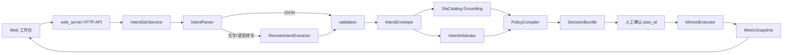

# 车联网通信意图理解、知识落地与 SDN 决策演示

这是一个在本机运行的车联网通信网络 Demo。它演示如何把调度员、网络运营方、驾驶员或应用提交的自然语言需求，转换为受限的语义意图，再经过本地 SLA 知识落地、多意图仲裁、白名单策略评价和人工确认，最终在一次性 Mininet/Open vSwitch 拓扑中验证策略效果。

这个项目关心的是通信网络意图，例如“救护车消息必须低时延”或“拥塞时限制背景视频”。它不做道路交通灯控制、车辆路径规划、计算任务卸载，也不宣称是与真实网络持续同步的完整数字孪生系统。

详细设计见 [docs/plan.md](docs/plan.md)，任务状态见 [docs/todo.csv](docs/todo.csv)，实测记录见 [docs/acceptance.md](docs/acceptance.md)。

## 1. Demo 能演示什么

一次完整演示包含以下环节：

1. 从结构化 JSON、文字或浏览器语音转写结果中提交意图。
2. 将输入规范化为统一的 `IntentEnvelope` 和 `Intent IR`。
3. 校验车辆、业务、目标、单位、数值边界、原文证据和未知字段。
4. 根据服务类型查询进程内只读 SLA 目录，生成带版本和来源的 `GroundingRecord`。
5. 将最多 10 份不同角色的意图汇总，按硬/软目标和角色等级处理冲突。
6. 对四个固定白名单策略进行确定性可行性与效用评价。
7. 在页面中展示落地证据、被覆盖意图、阻断原因、所有候选和最终选择理由。
8. 仅在用户点击“确认验证”后，才在临时 Mininet 拓扑中下发固定 OpenFlow/QoS 动作。
9. 在同一压力场景下对比基线与策略后的 P95 时延、吞吐量、丢包率和路径利用率。

页面的操作结构如下：

```text
┌ 01 输入与来源 ────────────────────────────────────┐
│ 选择角色 + JSON / 文字 / 语音转写 + 待汇总来源列表       │
└───────────────────────────────────────────────────┘
┌ 02 语义与知识落地 ┐  ┌ 03 仲裁与策略预览 ┐  ┌ 04 拓扑与指标 ┐
│ Intent IR          │  │ 冲突/覆盖/候选/选择 │  │ SVG 路径和实测指标 │
│ SLA Grounding      │  │ 固定动作人工确认     │  │ 基线与策略后对比 │
└────────────────────┘  └────────────────────────┘  └──────────────────┘

       [1. 加入来源意图]  [2. 编译策略]  [3. 确认验证]  [重置]
```

## 2. 系统架构

### 2.1 端到端调用链



调用关系的核心原则是：越靠近外部的数据越不可信，越靠近执行层的数据越必须来自内部固定模板。大模型的输出不会直接进入命令或 OpenFlow 参数。

### 2.2 各层职责

| 层次 | 主要组件 | 作用 | 明确不做的事 |
|---|---|---|---|
| 表现层 | `web/index.html` `web/app.js` `web/styles.css` | 收集输入、汇总多来源、展示 IR、Grounding、候选、拓扑和指标 | 不在浏览器中生成或下发网络命令 |
| HTTP 适配层 | `web_server.py` | 只监听 `127.0.0.1`，提供 JSON API 和静态文件，统一错误响应 | 不在 Handler 中实现仲裁和策略逻辑 |
| 应用编排层 | `service.py` | 组合解析、Grounding、仲裁、编译和执行；管理已预览计划与最近指标 | 不相信客户端传回的动作或 Grounding |
| 语义抽取层 | `parser.py` `extractor.py` | JSON 直接适配；文字/转写文本调用远程 LLM 生成受限 JSON | LLM 不生成 SLA 数值、流表、路径、队列或命令 |
| 信任边界 | `validation.py` | 将外部 JSON 转为强类型 IR，拒绝未知字段、非法枚举、越界数值和伪造证据 | 不替用户补齐缺失的语义或数值 |
| 知识落地层 | `grounding.py` | 把服务映射到服务端只读 SLA 条目，生成派生约束和版本证据 | 不允许客户端覆盖 SLA 目录 |
| 冲突仲裁层 | `arbitration.py` | 按范围分组，处理硬/软目标、角色等级和互斥约束 | 同级硬冲突不猜测取舍，必须阻断 |
| 决策层 | `policy.py` | 生成固定候选，用确定性安全评价和可解释效用进行稳定选择 | 评价器可替换，但不能绕过固定安全门 |
| 执行验证层 | `execution.py` | 创建临时 Mininet 拓扑，执行内部 `CandidatePlan`，采集成对指标并清理 | 不接受客户端自由命令或长期保留网络状态 |

### 2.3 核心数据结构

| 对象 | 在流程中的作用 | 重要字段 |
|---|---|---|
| `Intent` | 一条经校验的通信意图 | `scope` `objective` `service` `strength` `priority` `constraints` `semantic_requirements` `evidence` `ambiguities` |
| `IntentEnvelope` | 一次来源请求的唯一标准封装 | `request_id` `source_channel` `actor_role` `original_text` `intents` |
| `GroundingRecord` | SLA 知识落地的可追溯证据 | `service` `profile_id` `profile_version` `derived_constraints` `preference_order` `conflicts` |
| `ArbitrationResult` | 多意图仲裁结果 | `status` `active_intents` `suppressed_intents` `blockers` |
| `CandidatePlan` | 可以被预览和确认的白名单计划 | `plan_id` `supported_objectives` `guarantees` `actions` |
| `CandidateEvaluation` | 某个候选的安全性、覆盖率和效用分解 | `feasible` `hard_satisfied` `soft_coverage` `utility_score` `rejection_reasons` |
| `DecisionBundle` | 策略编译 API 的完整输出 | `arbitration` `grounding` `candidates` `selected_plan` `selection_reason` |
| `MetricSnapshot` | 一次 Mininet 验证的成对实测 | `plan_id` `baseline` `applied` |

`SemanticRequirement` 只表达“低时延”、“高可靠性”一类定性需求和其原文证据。数值约束只能来自用户原文中明确出现的数字，或者服务端版本化 SLA 目录，两者来源会分开记录。

## 3. 固定演示场景

### 3.1 业务、车辆和 SLA

| 业务 | 车辆 ID | Mininet IP | UDP 端口 | 服务类型 | 当前 SLA 派生约束 |
|---|---|---:|---:|---|---|
| 紧急 V2X | `veh-emergency-01` | `10.0.0.11` | `5001` | `emergency_v2x` | 时延 `<= 20 ms`，最小带宽 `>= 12 Mbps` |
| 车辆控制 | `veh-control-02` | `10.0.0.12` | `5002` | `vehicle_control` | 只提供延迟/可靠性/带宽偏好顺序，不补造数值 |
| 导航与状态 | `veh-navigation-03` | `10.0.0.13` | `5003` | `navigation` | 只提供延迟/带宽偏好顺序，不补造数值 |
| 背景视频 | `veh-video-04` | `10.0.0.14` | `5004` | `background_video` | 最大带宽 `<= 8 Mbps` |

客户端不能新增车辆 ID、业务端口或 SLA 数值。这些值分别由 `topology.py`、`grounding.py` 和 `policy.py` 的内部常量决定。

### 3.2 Mininet 网络

```text
veh-emergency-01 ─┐
veh-control-02   ─┤             ┌─ low-latency path  ─┐
veh-navigation-03─┼─ RSU switch ─┤                       ├─ Edge switch ─ Edge host
veh-video-04     ─┘             └─ high-capacity path ─┘
```

- 车辆到 RSU：100 Mbps，1 ms。
- 低时延分支：RSU—Low 和 Low—Edge Switch 各 20 Mbps、5 ms。
- 高容量分支：RSU—High 和 High—Edge Switch 各 50 Mbps、15 ms。
- Edge Switch 到 Edge Host：100 Mbps，1 ms。
- 所有交换机都使用显式 DPID、OpenFlow 1.3 和 secure fail mode。

### 3.3 白名单策略

| `plan_id` | 目标 | 固定动作 |
|---|---|---|
| `baseline` | 不修改策略 | 无动作，保留基线转发 |
| `critical_priority` | 保障紧急业务 | UDP 5001 走低时延路径；队列 1 最小速率 12 Mbps |
| `congestion_relief` | 治理背景视频 | UDP 5004 走高容量路径；QoS 和 OpenFlow meter 2 限制为 8 Mbps |
| `combined` | 同时保障紧急业务并治理视频 | 合并 `critical_priority` 与 `congestion_relief` 的固定动作 |

策略选择先过滤拓扑资源越界和未满足硬目标的候选，再按硬目标覆盖、来源等级、软目标优先级和 SLA 偏好计算效用。同分时优先动作更少的计划，最后以 `plan_id` 保证稳定结果。当前没有可靠动态预测模型，因此候选中的动态 KPI 明确为 `not_available`，不用模板常量冒充预测值。

## 4. 仓库目录和文件职责

### 4.1 目录概览

```text
.
├── README.md
├── AGENTS.md
├── pyproject.toml
├── llm-config.local.json       # 本地忽略，不提交
├── docs/
│   ├── plan.md
│   ├── todo.csv
│   └── acceptance.md
├── intent_sdn_demo/
│   ├── __init__.py
│   ├── __main__.py
│   ├── models.py
│   ├── errors.py
│   ├── topology.py
│   ├── extractor.py
│   ├── parser.py
│   ├── validation.py
│   ├── grounding.py
│   ├── arbitration.py
│   ├── policy.py
│   ├── service.py
│   ├── execution.py
│   ├── web_server.py
│   └── web/
│       ├── index.html
│       ├── app.js
│       └── styles.css
└── tests/
    ├── __init__.py
    ├── test_intent_flow.py
    ├── test_v2.py
    ├── test_execution.py
    └── test_web_server.py
```

### 4.2 根目录与设计文档

| 文件 | 作用 |
|---|---|
| `README.md` | 项目入口文档，说明 Demo 用途、架构、文件职责、启动、操作和验证方式。 |
| `AGENTS.md` | 仓库开发与协作规范，只影响开发过程，不参与 Demo 运行。 |
| `pyproject.toml` | Python 项目元数据；要求 Python `>=3.12`，基础模式没有第三方 Python 依赖。 |
| `.gitignore` | 忽略 Python 缓存、本地 LLM 密钥配置等不应提交的文件。 |
| `llm-config.local.json` | 本地运行时的远程模型配置，包含 API Key；被 Git 忽略，不是仓库交付物。 |
| `docs/plan.md` | 完整方案：范围、Intent IR、Grounding、仲裁、策略、Mininet 和安全边界。 |
| `docs/todo.csv` | 分阶段任务、依赖、产出、验收标准和当前状态。 |
| `docs/acceptance.md` | 自动化验证、真实 Cloud 诊断、Mininet/OVS 实测数据和剩余风险。 |

### 4.3 Python 后端文件

| 文件 | 主要类/函数 | 具体职责 | 与其他文件的关系 |
|---|---|---|---|
| `intent_sdn_demo/__init__.py` | `IntentSdnService` `SlaCatalog` `default_sla_catalog` | 定义包说明，并集中导出最常用的应用服务与 SLA 目录入口。 | 使调用方可以从 `intent_sdn_demo` 顶层导入这三个对象。 |
| `intent_sdn_demo/__main__.py` | `main` 转发 | 支持 `python3 -m intent_sdn_demo`。 | 把命令行入口转交给 `web_server.main()`。 |
| `intent_sdn_demo/models.py` | 枚举与不可变 dataclass | 定义系统共享语言：Intent、Grounding、仲裁、候选、决策和指标。 | 是其他业务模块的底层数据契约，不负责 HTTP 或执行。 |
| `intent_sdn_demo/errors.py` | `IntentError` | 定义可预期业务错误的 `code` `message` `status_code`。 | `web_server.py` 将它转换为一致的 JSON 错误响应。 |
| `intent_sdn_demo/topology.py` | `TrafficProfile` `TopologyInventory` `default_topology()` | 集中保存允许的车辆、IP、UDP 端口、路径、资源和计划 ID。 | `validation.py`、`policy.py`、`service.py` 和前端拓扑都使用这份清单。 |
| `intent_sdn_demo/extractor.py` | `LlmConfig` `RemoteIntentExtractor` | 严格加载 JSON/环境变量配置；调用 OpenAI 兼容协议或 Ollama `/api/chat`；分类鉴权、404、限流、超时、DNS、TLS 和读取错误。 | 只向 `parser.py` 返回候选 `{"intents": [...]}`，结果还必须经过 `validation.py`。 |
| `intent_sdn_demo/parser.py` | `IntentParser` | 按 `SourceChannel` 路由输入：JSON 绕过 LLM，文字/语音转写使用 extractor。 | 将所有输入最终交给 `build_envelope()`，生成同一 IR。 |
| `intent_sdn_demo/validation.py` | `build_envelope()` `envelope_from_dict()` | 实施 Schema、枚举、数量、长度、单位、数值、拓扑实体和证据校验。 | 是 LLM、前端 JSON 和编译请求的共同信任边界。 |
| `intent_sdn_demo/grounding.py` | `SlaProfile` `SlaCatalog` | 保存四类服务的版本化只读 SLA，为每条 Intent 重建 Grounding，检测显式与派生约束冲突。 | `service.py` 每次编译都从该模块重新落地，不信任客户端 Grounding。 |
| `intent_sdn_demo/arbitration.py` | `IntentArbitrator` | 按车辆和业务范围分组；识别反向目标与带宽上下界冲突；输出活跃、被覆盖和阻断意图。 | 使用 `dispatcher > operator > driver > application` 的来源等级，结果交给 `policy.py`。 |
| `intent_sdn_demo/policy.py` | `CandidateGenerator` `DeterministicDecisionEvaluator` `StableDecisionSelector` `PolicyCompiler` | 生成四个固定计划，检查资源/范围/约束覆盖，计算可解释效用，输出 `DecisionBundle`。 | 可替换评价接口，但始终叠加本地确定性安全评价，外部评分不能修改候选动作。 |
| `intent_sdn_demo/service.py` | `IntentSdnService` | 对外提供 parse/compile/apply/reset 业务入口；缓存当前可确认计划和最近实测指标；串行化编译、执行和重置。 | 是 `web_server.py` 与所有领域模块之间的应用服务门面。 |
| `intent_sdn_demo/execution.py` | `MininetExecutor` | 检查 root 与外部命令，构建固定拓扑，安装基线流表，执行计划，采集 iperf/ping/OVS 计数并清理资源。 | 只接收 `service.py` 缓存的内部 `CandidatePlan`，不解析用户文本。 |
| `intent_sdn_demo/web_server.py` | `IntentSdnRequestHandler` `create_server()` `main()` | 解析 CLI、组装服务、绑定回环地址、限制 HTTP 请求体并托管 API/静态资源。 | `__main__.py` 的实际启动目标；通过 `IntentSdnService` 进入业务流程。 |

### 4.4 前端文件

| 文件 | 作用 |
|---|---|
| `intent_sdn_demo/web/index.html` | 定义四栏工作台、角色/通道选择、多来源列表、输出区和四个操作按钮。 |
| `intent_sdn_demo/web/app.js` | 保存页面内状态，调用解析、编译、确认、重置、拓扑和指标六个 API，管理最多 10 份 envelope，渲染语义/Grounding/候选/SVG 拓扑/指标，调用浏览器语音识别。 |
| `intent_sdn_demo/web/styles.css` | 定义响应式四栏布局、状态颜色、数据面板、拓扑、指标卡和移动端样式。 |

### 4.5 测试文件

| 文件 | 主要覆盖范围 |
|---|---|
| `tests/__init__.py` | 将 `tests` 标记为可导入测试包。 |
| `tests/test_intent_flow.py` | 结构化/文字解析、多来源仲裁、硬冲突、歧义阻断、预览令牌和确认下发主流程。 |
| `tests/test_v2.py` | Semantic Intent、SLA Grounding、候选评价、安全门、状态并发、LLM JSON 配置、Ollama/OpenAI 协议和网络错误分类。 |
| `tests/test_execution.py` | Mininet 环境检查、拓扑命名、流表/QoS/meter、清理、iperf/ping 解析和端口利用率计算。 |
| `tests/test_web_server.py` | 真实本地 HTTP Handler、静态页面、健康检查、解析、编译和禁用 Mininet 时的错误路径。 |

## 5. 本地启动

### 5.1 基础模式

项目要求 Python 3.12 或更高版本。基础模式只使用 Python 标准库：

```bash
python3 -m intent_sdn_demo --port 8765
```

浏览器打开 `http://127.0.0.1:8765/`。该模式可演示 JSON 解析、Grounding、仲裁和策略预览；未启用 Mininet 时点击“确认验证”会明确返回 `mininet_disabled`，不会伪造指标。

### 5.2 配置文字和语音转写的 LLM

JSON 输入不调用 LLM。文字和语音转写文本需要远程模型。推荐使用被 `.gitignore` 排除的 `llm-config.local.json`。

OpenAI Chat Completions 兼容服务：

```json
{
  "provider": "openai",
  "base_url": "https://模型服务地址/v1",
  "api_key": "本机私密密钥",
  "model": "模型名称",
  "timeout_seconds": 30
}
```

直接访问 Ollama Cloud，不需要本地 Ollama：

```json
{
  "provider": "ollama",
  "base_url": "https://ollama.com",
  "api_key": "Ollama API Key",
  "model": "qwen3.5:397b",
  "timeout_seconds": 300
}
```

Ollama Cloud 模型目录会变化，`model` 必须与官方 [`GET /api/tags`](https://ollama.com/api/tags) 返回的 `name` 完全一致。例如 `qwen3.5:9b` 是常见本地尺寸标签，但它不在当前 Cloud 目录时会返回 404。Ollama 分支固定调用 `POST /api/chat`，发送 `stream:false`、`think:false`、温度 0 和 4096 token 生成上限，读取 `message.content`。Cloud 当前不支持 structured outputs，因此不发送 `format`，而是依靠固定提示词和本地严格校验。

启动：

```bash
unset LLM_BASE_URL LLM_API_KEY LLM_MODEL
python3 -m intent_sdn_demo --llm-config ./llm-config.local.json --port 8765
```

JSON 文件只在服务启动时加载，修改后必须重启。如果 `LLM_BASE_URL`、`LLM_API_KEY`、`LLM_MODEL` 中任意一个已经设置，它会按字段覆盖 JSON，启动日志会告警被覆盖的字段。正常日志应能看到：

```text
远程模型配置：提供方=ollama，主机=ollama.com，端点=/api/chat，模型=qwen3.5:397b，...，来源=json
```

常见上游错误：

| 日志/HTTP | 含义 | 优先检查 |
|---|---|---|
| 401/403 | API Key、账号或模型访问权限被拒绝 | `api_key` 和账号权限 |
| 404 | 端点或模型不存在 | 启动日志的 `端点` 与官方 `/api/tags` 中的精确模型名 |
| 429 | 上游限流 | 账号配额和请求频率 |
| `类型=timeout` | 请求或响应等待超时 | 网络、模型生成时间和 `timeout_seconds` |
| `类型=dns/connect/tls/read` | 名称解析、连接、证书或响应读取失败 | 本机代理、防火墙、CA 和链路状态 |

配置文件最大 16 KiB，只允许 `provider`、`base_url`、`api_key`、`model`、`timeout_seconds` 五个字段。API Key 不会进入日志或 HTTP 错误响应。

### 5.3 启用 Mininet 实测

策略执行默认关闭。实测需要 Linux、root、Mininet、Open vSwitch、`iperf`、`mn`、`ovs-ofctl` 和 `ovs-vsctl`：

```bash
sudo python3 -m intent_sdn_demo \
  --llm-config ./llm-config.local.json \
  --enable-mininet \
  --port 8765
```

每次确认验证都会：

1. 创建一套独立拓扑并安装静态 ARP 和基线流表。
2. 在 18 Mbps 背景视频压力下，采集紧急 5 Mbps、控制 3 Mbps、导航 2 Mbps 的基线指标。
3. 下发所选白名单计划，在同样压力下采集策略后指标。
4. 从 ping 和 iperf 输出计算 P95 时延、吞吐量和丢包率，从 RSU 出口 OVS TX 字节增量计算路径利用率。
5. 验证视频限速等策略效果，超出容差时返回失败而不是伪造成功。
6. 无论成功还是异常，都尝试清理 meter、QoS、Queue 并停止拓扑。

## 6. 页面操作方法

1. 启动服务并打开工作台。
2. 在第一栏选择来源角色与输入通道。
3. JSON 通道可载入“紧急业务优先”、“背景视频治理”、“综合保障”、“同级硬冲突”和“非法车辆”五个示例。
4. 点击“加入来源意图”。每次会得到一个 envelope，可以切换角色继续加入，上限为 10 份。
5. 点击“编译策略”，服务端会对所有 envelope 重新校验、Grounding、仲裁和评价。
6. 检查第二栏的语义/SLA 证据和第三栏的候选/固定动作。
7. 只有当 `DecisionBundle.status=ready` 且存在 `selected_plan` 时，“确认验证”才可用。
8. 点击确认后，后端只根据 `plan_id` 取出当前进程内已预览的计划，不使用前端提交的动作。
9. 新的编译请求、阻断结果或“重置”都会使旧预览和旧指标失效，防止确认历史计划。

角色选择只是 Demo 中的来源标识，不等同于真实身份认证或授权系统。

## 7. HTTP API

| 方法与路径 | 输入 | 输出/作用 |
|---|---|---|
| `GET /api/health` | 无 | 服务健康状态 |
| `GET /api/topology` | 无 | 可安全展示的固定车辆、业务和路径摘要 |
| `GET /api/metrics` | 无 | 最近一次成功 Mininet 验证指标；没有时返回 `not_available` |
| `POST /api/intents/parse` | `source_channel` `actor_role` `payload` | 将一份来源输入转为 `IntentEnvelope` |
| `POST /api/policies/compile` | `envelope` 或 `envelopes` | 重新校验并返回 `DecisionBundle` |
| `POST /api/policies/apply` | `plan_id` | 仅确认当前已预览的计划，执行 Mininet 验证 |
| `POST /api/policies/reset` | 空对象 | 清除当前预览和最近指标 |

文字解析请求示例：

```json
{
  "source_channel": "text",
  "actor_role": "dispatcher",
  "payload": "救护车消息必须低时延，背景视频可以降级。"
}
```

编译多来源请求的结构示意如下。为避免把解析结果手工抄错，实际调用应直接把一次或多次 parse API 返回的完整 envelope 放入数组：

```json
{
  "envelopes": [
    {
      "request_id": "req-123456789abc",
      "source_channel": "text",
      "actor_role": "dispatcher",
      "original_text": "救护车消息必须低时延。",
      "intents": [
        {
          "scope": {
            "vehicle_ids": ["veh-emergency-01"],
            "traffic_class": "emergency"
          },
          "objective": "minimize_latency",
          "strength": "must",
          "priority": "critical",
          "constraints": [],
          "evidence": ["救护车消息必须低时延"],
          "ambiguities": [],
          "semantic_requirements": [
            {
              "metric": "latency",
              "level": "low",
              "origin": "explicit",
              "evidence": "救护车消息必须低时延"
            }
          ],
          "service": "emergency_v2x"
        }
      ]
    }
  ]
}
```

`compile` 必须且只能提交 `envelope` 或 `envelopes` 之一；每个 envelope 的 `intents` 必须非空，并会在服务端重新校验。

所有可预期失败都返回统一结构：

```json
{
  "error": {
    "code": "machine_readable_code",
    "message": "可读但不包含密钥和内部堆栈的中文说明"
  }
}
```

## 8. 安全与一致性边界

- Web 服务只绑定 `127.0.0.1`，不默认暴露到局域网。
- HTTP 请求体最大 64 KiB，远程模型响应最大 1 MiB，文字输入最大 2000 字符。
- 模型输出、前端 JSON 和编译时回传的 envelope 都会经过校验，不会因为“来自模型”而获得信任。
- 文字证据必须是 `original_text` 的原文片段，语义需求的证据必须复用同一 Intent 的 evidence。
- 客户端不能提交 Grounding、SLA 版本、候选评价、动作或命令字段。
- `apply` 只接收 `plan_id`，并必须命中当前服务进程内已预览的计划。
- 编译、执行和重置共享网络锁，避免旧执行结果在新编译后回写。
- Mininet 命令参数只来自固定拓扑和白名单模板；OVS UUID、端口和命令执行结果还会二次校验。
- 密钥配置不应提交到 Git，日志不记录 API Key、原始上游错误正文或 HTTP 请求正文。

## 9. 测试与验收

```bash
python3 -m compileall -q intent_sdn_demo tests
python3 -m unittest discover -s tests -v
node --check intent_sdn_demo/web/app.js
git diff --check
```

当前自动化测试覆盖了核心 IR、信任边界、Grounding、仲裁、候选选择、状态并发、LLM 协议与错误路径、Mininet 帮助函数和 HTTP 流程。当前受限沙箱不允许监听本地端口时，`test_web_server.py` 的真实 HTTP 用例会明确跳过，而不是伪装通过。

Mininet 是本项目的策略验证沙箱，不是生产执行器。`combined` 的真实实测、视频 meter 限速缺陷及修复后复测数据都记录在 [docs/acceptance.md](docs/acceptance.md)。

## 10. 当前边界与后续扩展点

- 没有用户账号、持久化数据库或真实身份认证；页面角色是演示元数据。
- 预览计划和最近指标仅存在内存中，服务重启后清空。
- 没有训练 GNN/DRL；`DecisionEvaluator` 只为后续安全接入动态评分保留接口。
- 当前四个候选和网络动作是固定 Demo 模板，增加新业务或拓扑时需同步修改模型枚举、拓扑清单、SLA、白名单计划和测试。
- 当前 Ollama 使用非流式响应。如果在有效凭据、正确模型名、`think:false` 和有界输出下仍长时间无首字节，后续可扩展 NDJSON 流式累积解析。
- 策略模板中的 SLA 数值是配置能力声明；若要升级为生产级运行期 SLA，还需要多次采样、置信区间、准入、回退和持续监控。
