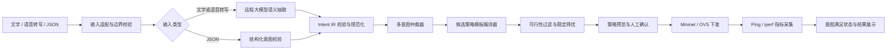

# 车联网通信意图转译与 SDN 策略下发演示方案

## 1. 项目定位

本项目重构为一个聚焦于**车联网通信意图转译**的演示系统。系统接收驾驶员、调度方、网络运营方或应用提出的文字、语音转写和结构化 JSON 意图，将其转成统一的结构化中间表示，再编译为可验证的 SDN QoS 与转发策略，并在 Mininet 中完成下发前后的指标对比。

核心问题不是“让大模型直接配置网络”，而是建立一条可审计、可复现的链路：

```text
原始意图 → Intent IR → 规则仲裁 → 候选策略 → 确认下发 → 指标验证
```

本 Demo 验证的是**车联网通信网络拥塞与业务保障**，不是道路车辆拥堵。道路交通流、车辆移动和信号灯控制需要 SUMO 或 Mininet-WiFi 等额外系统，明确不纳入第一版。

## 2. 第一版目标与边界

### 2.1 目标

- 支持文字、浏览器语音转写和结构化 JSON 三类输入。
- 支持调度方、网络运营方、驾驶员和应用四类意图来源。
- 将非结构化意图转换为统一 `Intent IR`，并展示原文证据与歧义。
- 对同一业务范围内的多条意图执行确定性的冲突消解和策略选择。
- 通过固定策略模板生成 OpenFlow 流规则、路径选择和 OVS QoS 队列配置。
- 在 Mininet 中展示策略下发前后的紧急业务时延、各类业务吞吐量、丢包率和链路利用率。

### 2.2 明确不做

- 不做任务卸载、边缘计算资源分配、数字孪生、历史案例库和多智能体协商。
- 不做道路交通拥堵控制、SUMO 联动和无线信道仿真。
- 不让大模型生成、执行或修改 Shell 命令、OpenFlow 命令和 QoS 数值。
- 不做模型微调、知识图谱、多轮澄清对话、身份认证和自动纠偏闭环。

## 3. 总体架构



该分层对应意图摄取、意图转译、编排和保障四类职责。意图是目标和约束的声明；策略是更低层、可下发的实现表达，两者不能混为一次大模型生成。[RFC 9315](https://www.rfc-editor.org/rfc/rfc9315.html)

## 4. 输入与统一 Intent IR

### 4.1 输入规则

- 文字输入最多 2000 个字符；语音输入仅负责在浏览器中转写为文字，后端不另建语音语义链路。
- JSON 输入直接进入结构化校验，不调用大模型。
- 意图来源由页面角色选择器提供；大模型不得推断或改写来源身份。
- 车辆编号、业务类型和数值约束必须存在于当前拓扑清单中。
- 不支持的意图、未知实体、越界数值、模型非法输出均显示为失败原因，不进入下发流程。

### 4.2 Intent IR 定义

一次请求用 `IntentEnvelope` 表达；其中 `intents` 可以拆出多条作用于不同对象的意图。

```json
{
  "request_id": "req-0001",
  "source_channel": "text",
  "actor_role": "dispatcher",
  "original_text": "救护车消息一定先走，视频慢一点没关系。",
  "intents": [
    {
      "scope": {"vehicle_ids": ["veh-emergency-01"], "traffic_class": "emergency"},
      "objective": "prioritize_traffic",
      "strength": "must",
      "priority": "critical",
      "constraints": [],
      "evidence": ["救护车消息一定先走"],
      "ambiguities": []
    },
    {
      "scope": {"vehicle_ids": [], "traffic_class": "video"},
      "objective": "limit_background_traffic",
      "strength": "prefer",
      "priority": "normal",
      "constraints": [],
      "evidence": ["视频慢一点没关系"],
      "ambiguities": []
    }
  ]
}
```

字段约束如下：

| 字段 | 允许值或格式 | 说明 |
|---|---|---|
| `actor_role` | `dispatcher`、`operator`、`driver`、`application` | 页面选择，决定冲突时的来源等级 |
| `traffic_class` | `emergency`、`control`、`navigation`、`video`、`all` | 与 Mininet 流量分类一一对应 |
| `objective` | `prioritize_traffic`、`minimize_latency`、`relieve_network_congestion`、`limit_background_traffic` | 第一版只支持四类网络目标 |
| `strength` | `must`、`prefer` | 分别表示硬目标与软偏好 |
| `priority` | `critical`、`high`、`normal`、`low` | 仅用于软目标加权和展示 |
| `constraints` | `latency_ms <= N`、`min_bandwidth_mbps >= N`、`max_bandwidth_mbps <= N` | 只接受显式给出的数值和单位 |

“必须、一定、不得”解析为 `must`；“尽量、优先、可以慢一点”解析为 `prefer`。未给出具体数值时，只保留语义强度，禁止补造时延、带宽或可靠性阈值。

## 5. 大模型与规则的职责边界

### 5.1 大模型：仅负责语义抽取

远程模型通过 `LLM_BASE_URL`、`LLM_API_KEY` 和 `LLM_MODEL` 配置。后端要求模型按固定 JSON Schema 输出 `IntentEnvelope`，并提供每个结构化字段对应的原文证据。请求温度使用可配置的低随机性值，默认 0。

模型只能：

- 识别业务对象、意图目标、语义强度、优先级、显式数值约束和歧义。
- 将一段多目标口语拆成多条 `Intent IR`。
- 标记未知或不支持的表达。

模型不能：

- 生成命令、路径端口、流表、队列编号或带宽配置。
- 伪造拓扑实体、未提及的数值和权限身份。
- 在冲突发生时自行决定覆盖关系。

大模型适合处理多意图的自然语言抽取；同时，已有研究也明确指出相近意图类别与缺失信息会产生歧义，因此必须由后续规则层校验和阻断不完整结果。[Manias 等，2024](https://arxiv.org/abs/2403.02238)

### 5.2 规则：保证确定性和可执行性

规则层依次执行：

1. JSON Schema、字段枚举、字符串长度、数值范围和拓扑实体校验。
2. 同义目标规范化与范围分组。
3. 多意图冲突消解。
4. 白名单策略模板编译。
5. 候选可行性过滤与稳定排序。
6. 将预览结果转换为已定义的 OpenFlow 与 OVS QoS 动作。

文字请求在模型不可用或返回非法 JSON 时必须失败并提示原因；不自动改用关键词猜测。JSON 请求不依赖模型，仍可独立演示。

## 6. 多意图仲裁与最终汇总决策

### 6.1 仲裁原则

“汇总决策”不是多智能体投票，也不是让大模型从候选中自由选择，而是确定性的策略仲裁。

1. 按 `(车辆范围, 业务类型)` 分组；不同范围的意图可并存。
2. 平台安全约束最高，其后来源等级依次为：调度方、网络运营方、驾驶员、应用。
3. 硬目标优先于软偏好；不能满足的硬目标不可静默降级。
4. 不同来源的直接冲突由更高来源等级覆盖，并记录被覆盖意图和原因。
5. 相同来源等级、相同范围内存在互相矛盾的硬目标时，状态为 `blocked`，禁止下发。
6. 不冲突的软偏好共同保留，用于候选覆盖率排序。

### 6.2 候选策略模板

策略编译器只生成以下白名单候选：

| 模板 | 作用 |
|---|---|
| `baseline` | 不改变当前流表与 QoS |
| `critical_priority` | 紧急业务走低时延路径并绑定高优先级队列 |
| `congestion_relief` | 背景视频走高容量路径，以出口队列和 OpenFlow 计量器固定限速 |
| `combined` | 同时实施紧急业务保障和背景流量治理 |

所有端口、队列编号、路径和限速值来自拓扑清单及模板常量；外部输入不允许影响命令形态。

### 6.3 选择算法

对每个候选按固定顺序处理：

1. 过滤引用不存在节点、端口或队列的候选。
2. 过滤无法覆盖全部 `must` 目标的候选。
3. 计算软目标覆盖率：每条软目标的权重为“来源等级 × 优先级等级”，候选支持该目标则计入分子。
4. 覆盖率相同，选择流表与 QoS 变更数量更少的候选。
5. 仍相同，按 `plan_id` 升序选择，保证同一输入得到同一结果。
6. 没有可行候选时返回阻断原因，不下发任何策略。

选择结果至少包含：保留和覆盖的意图、被抑制的意图、候选列表、选择理由、将要下发的流表/QoS 预览和回滚动作。

## 7. Mininet 演示拓扑与验证

### 7.1 拓扑

第一版使用一个 RSU 交换节点、两条到边缘服务节点的核心路径和四类车辆业务：

```text
紧急车辆 ─┐
控制车辆 ─┼─ RSU ── 低时延路径：20 Mbps / 5 ms ── Edge
导航车辆 ─┼─       └─ 高容量路径：50 Mbps / 15 ms ── Edge
视频车辆 ─┘
```

- 紧急、控制/导航、视频业务使用固定 IP 与端口分类。
- RSU、两条路径交换机和边缘侧交换机保留可读的展示名称，但显式配置唯一 16 位十六进制 DPID；Mininet 仅能从 `s1` 一类规范名称自动推导 DPID。[Mininet Switch API](https://mininet.org/api/classmininet_1_1node_1_1Switch.html)
- 车辆业务的外部编号保留在 Intent IR 和页面中；Mininet 内部主机使用短名，因为 Link 会生成 `节点名-ethN` veth 名称，而 Linux 接口名缓冲区仅有 `IFNAMSIZ`（16 字节，含结尾空字符）。[Mininet Link API](https://mininet.org/api/classmininet_1_1link_1_1Link.html)、[Linux netdevice(7)](https://man7.org/linux/man-pages/man7/netdevice.7.html)
- 基线状态将压力流量置于低时延路径，制造可观察的竞争。
- `critical_priority` 将紧急流量固定到低时延路径和高优先级队列。
- `congestion_relief` 将视频流量切到高容量路径；出口队列用于服务等级，OpenFlow 1.3 丢弃型计量器以 8 Mbps 固定上限执行数据面限速。
- `combined` 同时执行以上两项。

Mininet 使用真实 Linux 网络栈和 OpenFlow 交换机，适合在单机上测试可重复的 SDN 策略行为。[Mininet 官方概览](https://mininet.org/overview/)

### 7.2 指标与验收

每次确认下发创建一套独立临时拓扑：先保持基线流表，在相同视频压力下采集基线；再应用已确认的模板，采集策略后结果。两组结果必须成对返回，不以估算值代替任一侧。路径利用率在每个测量窗口前后读取 RSU 两个核心出口的 OVS TX 字节计数，以字节增量除以实际窗口时长和固定链路容量计算；不得按业务类型猜测流量路径。采集指标为：

- 紧急业务的 P95 往返时延。
- 各业务吞吐量。
- 各业务丢包率。
- 两条核心路径的链路利用率。
- 策略是否覆盖硬目标及其失败原因。

OVS QoS 使用出口整形与队列，队列配置后必须由 OpenFlow `set_queue` 流表选用；OpenFlow 1.3 调用 `ovs-ofctl` 时也必须显式使用 `-O OpenFlow13`。在本 Demo 的 TCLink 拓扑中，背景视频的 8 Mbps 硬上限还由 OpenFlow 1.3 丢弃型计量器执行，避免队列仅被选择却没有实际整形时将未达标策略报告为成功；测量值超过 8.5 Mbps 时本次执行必须失败。临时拓扑结束时，除解绑端口 QoS、销毁带所有者标记的 QoS 和 Queue 记录外，还要以 `del-meters <bridge> meter=<id>` 删除本次已创建的计量器。受控命令失败会保留固定命令的 OVS 诊断输出。[OVS QoS FAQ](https://docs.openvswitch.org/en/stable/faq/qos/)、[OVS 流动作与 `set_queue` 文档](https://docs.openvswitch.org/en/stable/ref/ovs-actions.7/)、[OVS `ovs-ofctl` 计量器命令参考](https://www.openvswitch.org/support/dist-docs/ovs-ofctl.8.html)

## 8. 对外接口与页面流程

后端接口固定为：

| 接口 | 作用 |
|---|---|
| `POST /api/intents/parse` | 输入文字、语音转写或 JSON，返回校验后的 `IntentEnvelope` |
| `POST /api/policies/compile` | 输入单个 `envelope` 或多个 `envelopes`，汇总后返回候选及最终 `DecisionBundle` |
| `POST /api/policies/apply` | 对已预览的 `plan_id` 执行固定下发动作 |
| `POST /api/policies/reset` | 清除服务内的预览和指标缓存；临时拓扑在每次验证结束时已停止 |
| `GET /api/metrics` | 返回最近一次验证的基线和策略后成对指标；未验证时返回 `not_available` |

页面固定采用“输入、结构化意图、仲裁预览、拓扑与指标”四栏，并将“确认下发”和“重置”作为显式操作：

```text
┌──────────────┬──────────────┬────────────────┬──────────────┐
│ 文字/语音/JSON│  Intent IR   │ 冲突与候选策略 │ Mininet 拓扑 │
│ 输入及角色选择│ 证据与歧义   │ 选择依据/预览  │ 实时指标     │
├──────────────┴──────────────┴────────────────┴──────────────┤
│        解析 → 编译 → 确认下发 → 前后指标对比 → 重置        │
└─────────────────────────────────────────────────────────────┘
```

## 9. 安全与异常处理

- Web 服务仅监听 `127.0.0.1`，不接受外部网络访问。
- 不在日志、接口响应或页面中返回 API 密钥、完整请求头或环境变量。
- 外部文本绝不拼接为 Shell 命令；执行层仅接受内部生成的模板标识和拓扑常量。
- 模型超时、网络失败、Schema 校验失败、拓扑不存在和硬约束冲突均 fail-fast，保留面向用户的原因。
- 下发在执行器中串行化；重复确认会独立创建和清理临时拓扑，重置只清除服务缓存。失败后清理本次创建的 QoS 和流表项。

## 10. 测试计划

- 口语化多意图拆分：紧急优先与视频可降级应生成两条 IR。
- 结构化 JSON：不调用模型且生成相同 IR 语义。
- 非法输入：超长文本、未知车辆、非法单位、越界数值和非法 JSON 必须被拒绝。
- 模型异常：无配置、超时和无效 JSON 时文字请求不得进入策略编译。
- 仲裁：高来源覆盖低来源；同等级硬冲突阻断；软目标合并可复现。
- 编译：候选必须只引用白名单队列、端口和路径；输入中含命令片段不影响执行参数。
- 选择：相同输入下稳定选择相同 `plan_id`，无可行候选不下发。
- Mininet 集成：压力流量下 `combined` 应改善紧急流量时延，并将视频流量导向高容量路径。
- 重置：下发、重复下发、重置后均无旧 QoS/流表残留；清理后必须重新查询带本次 owner 标记的 QoS 和 Queue 记录。

## 11. 后续扩展方向

第一版稳定后，可按以下顺序扩展：

1. 接入 SUMO 与 Mininet-WiFi，区分道路交通目标和通信网络目标。
2. 加入多轮澄清、意图有效期和撤销生命周期。
3. 建立真实角色认证、细粒度授权和审计留存。
4. 建立标注集，评估不同模型、提示词和领域微调的意图抽取准确率。
5. 以监控指标驱动受控的策略重规划，而非直接让模型自动下发。
